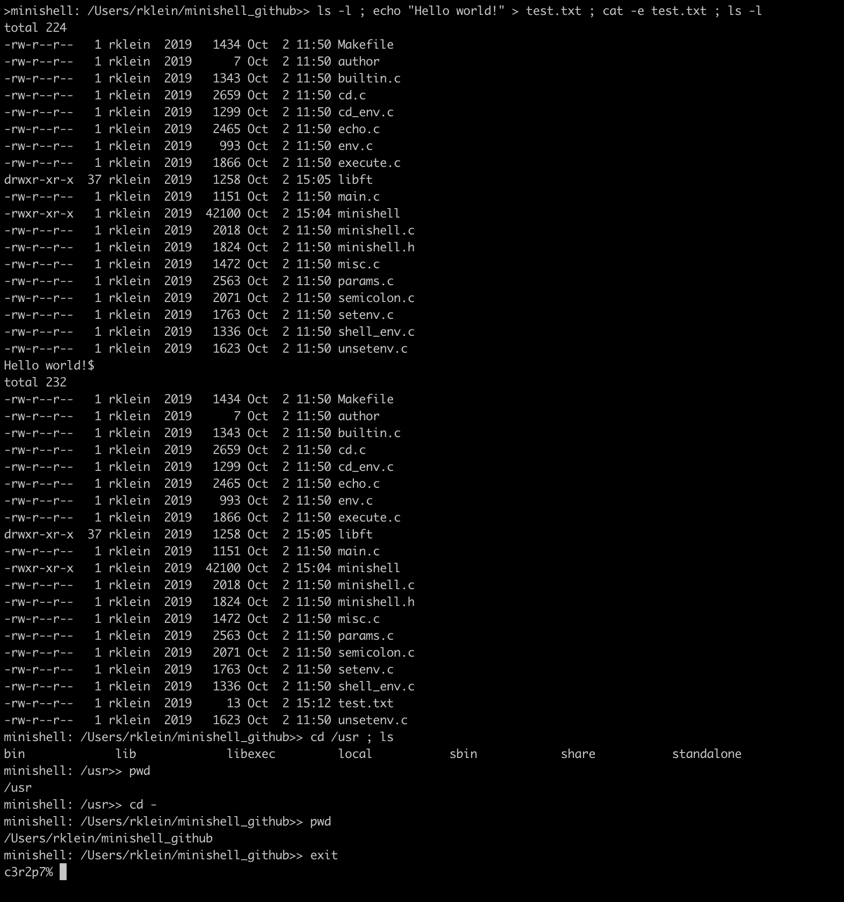

# minishell
A simple Unix command interpreter that does the following: 
* Displays a prompt and wait for a command, which is validated by pressing enter. 
* Simple commands; no pipes, no redirections (except > and >> with **echo** command). 
* Multiple commands separated by ';'. 
* Commands found in paths indicated by PATH environment variable. 
* Manage errors. 
* Manage '$' and '~' expansion. 

Minishell also includes builtins: **echo**, **cd**, and **exit**, as well as **env**, **setenv**, and **unsetenv** for displaying, modifying/adding, and deleting environment variables. 
### Usage
Repository contains a Makefile for:  
* compiling executable (**make all**) 
* removing object files (**make clean**) 
* deleting executable (**make fclean**) 
* recompiling (**make re**) 

Example: 
 
#### Notes:
This project is part of my studies at Hive Helsinki. It was thoroughly tested by 5 fellow Hive students.
